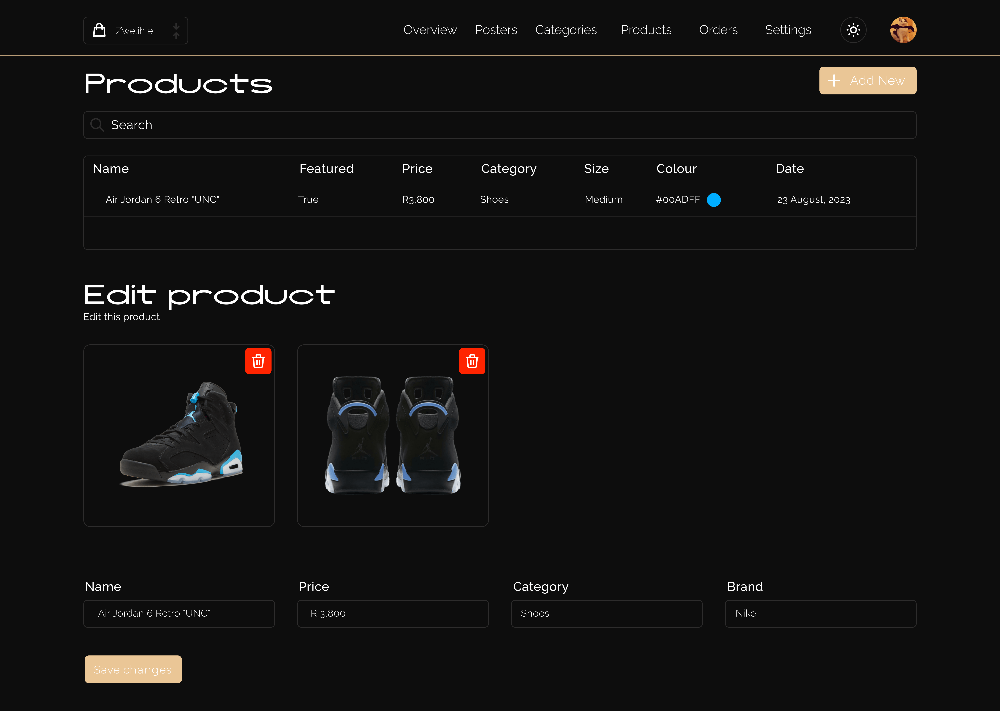

# Next js 13 Ecommerce admin dashboard

Zwelihle E-commerce Admin is the administrative backend for the
Zwelihle E-commerce Store, providing an intuitive and powerful
toolset for managing your e-commerce business. Developed using
Next.js, Tailwind CSS, TypeScript, and PlanetScale, this application
empowers business owners and administrators to efficiently handle
product management, order processing, customer support, and more.
With features like real-time data synchronization, user-friendly
forms powered by React Hook Form, and interactive data visualization
using Recharts, Zwelihle E-commerce Admin streamlines operations and
decision-making. Additionally, it integrates with Stripe for secure
payment processing and leverages PlanetScale for robust data storage
and retrieval. Whether you're updating product details, analyzing
sales trends, or responding to customer inquiries, Zwelihle
E-commerce Admin equips you with the tools you need to run a
successful e-commerce business.

## Demo

https://zwelihle-ecommerce-admin.vercel.app/

## Overview
Zwelihle E-commerce Admin is tailored to meet the needs of business owners and administrators, offering a comprehensive set of features:

Efficient Product Management: Update and manage your product catalog effortlessly to keep your store up-to-date.
Streamlined Order Processing: Handle orders efficiently and keep track of inventory to ensure smooth operations.
Responsive Customer Support: Engage with your customers promptly and effectively to build trust and loyalty.
Real-time Data Synchronization: Stay informed with real-time updates on your store's performance and customer activity.
Secure Payment Processing: Integrated with Stripe for secure payment processing, ensuring a safe transaction experience for your customers.

## Technologies Used

- [Next.js 14](https://nextjs.org/)
- [Tailwind CSS](https://tailwindcss.com/)
- [Shadcn UI](https://ui.shadcn.com/)
- [Prisma](https://www.prisma.io/)
- [Planet Scale](https://planetscale.com/)

## Installation

- npm install

